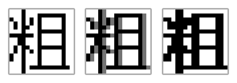

# Pebble Font Tool

This is a set of scripts and tooling that helps generate or design fonts for PebbleOS. This tool is specifically designed for CJK fonts.

The tooling codes are written in TypeScript and can be run directly with [Bun](https://bun.sh/).

## Bold Conversion

Bold font can be generated by copying the glyph 1px to the right



This conversion can cut the design work in half by not having to worry about making dedicated BOLD variants.

## Codepoints Coverage

> PebbleOS currently works directly with codepoints with no concept of graphemes / glyphs.

The fonts target the standard CJK documents listed below, plus the
[extra](./data/pages/extra) and [others](./data/pages/others) documents (place
names, medicines, ...) and the most frequent characters from
[`FREQUENCY`](./data/FREQUENCY).

### Building pages.txt

`build/pages.txt` (the codepoint set used for extraction) is generated from
those documents. From the tumbled project root (with PebbleFontTool cloned into
it):

```bash
bun run ./PebbleFontTool/scripts/combine.ts
```

It prints the coverage report and writes `build/pages.txt`.

`scripts/extract.ts` then rasterizes those codepoints into a glyph project:

```bash
# reference font used by the editor (defaults to Unifont at height 24)
bun run ./PebbleFontTool/scripts/extract.ts

# a specific variant, defined by one of build/*.json
bun run ./PebbleFontTool/scripts/extract.ts build/fusion12.json
```

Definitions support `fontFile`, `fontName`, `fontSize`, `topOffset`,
`leftOffset`, `advanceOffset`, `renderWidth`, `renderHeight`, `wildcardWidth`,
`wildcardHeight`, `ranges`, `autoJiggle` and `forceAutohint`. Glyphs go to
`./fonts/<fontName>` relative to the current directory (or to `outputDir`), so
run the scripts from the tumbled project root. Pass `--force` to overwrite
existing glyphs; without it, existing files are kept.

To find regional glyph variants (e.g. Japanese vs Simplified Chinese forms),
compare fonts against the same page set:

```bash
bun run ./PebbleFontTool/scripts/regional_mapping.ts base.ttf variant-jp.ttf variant-cn.ttf
```

This writes `regional_mapping.json` for the editor.

Projects that are staged under a different name (for example `TEST_FZ`, the
working project for `TUMBLED_18`) are merged with `scripts/merge.ts`:

```bash
# dry run, then write
bun run ./PebbleFontTool/scripts/merge.ts fonts/TEST_FZ fonts/TUMBLED_18
bun run ./PebbleFontTool/scripts/merge.ts fonts/TEST_FZ fonts/TUMBLED_18 --write
```

It only adds glyphs that do not exist in the target (never overwrites),
restricts itself to the codepoints in `build/pages.txt` (pass `--all` to
ignore the page set), and copies every shape referenced by the added glyphs
so composed glyphs keep working. It warns when the two projects have
different heights or when a glyph references a shape the source lacks.

### Document Coverage

Overall **10,978 glyphs** are bundled into each font: the characters selected
from the documents below plus the wildcard glyph.

| Script                       | Document                   | Coverage            |
| ---------------------------- | -------------------------- | ------------------- |
| Simplified Chinese           | 通用规范汉字表（一级）     | 3500/3500 (100.00%) |
| Traditional Chinese          | 常用國字標準字體表         | 4808/4808 (100.00%) |
| Japanese Standard Kanji      | 日本常用漢字表             | 2135/2136 (99.95%)  |
| Hong Kong Variants (Common)  | 常用香港外字表（AB1234ㄅ） | 456/532 (85.71%)    |
| Korean Hanja                 | 한문 교육용 기초한자       | 1799/1800 (99.94%)  |
| Bopomofo                     | 注音符號                   | 43/43 (100.00%)     |
| Hiragana + Katakana          | 仮名                       | 187/187 (100.00%)   |
| Hangul                       | 한글                       | 2350/2350 (100.00%) |
| Periodic Table (Simplified)  | 元素周期表                 | 109/118 (92.37%)    |
| Periodic Table (Traditional) | 元素週期表                 | 114/118 (96.61%)    |

Supplementary Coverage

| Script                         | Document               | Coverage           |
| ------------------------------ | ---------------------- | ------------------ |
| Simplified Chinese (Secondary) | 通用规范汉字表（二级） | 2213/3000 (73.77%) |
| Hong Kong Variants (Remaining) | 常用香港外字表（其餘） | 160/1066 (15.01%)  |

Extra Coverage

| Script                            | Document         | Coverage         |
| --------------------------------- | ---------------- | ---------------- |
| National Essential Medicines List | 国家基本药物目录 | 708/709 (99.86%) |
| Mainland province/city/county     | 中国大陆地名     | 1275/1275 (100%) |
| Taiwan counties and townships     | 臺灣地名         | 315/315 (100%)   |
| Hong Kong places                  | 香港地名         | 39/39 (100%)     |
| Macau places                      | 澳門地名         | 27/27 (100%)     |
| Japanese municipalities           | 日本地名         | 790/790 (100%)   |

## Language Packs (.pbl)

PebbleOS ships custom extended fonts as a **language pack**: a regular
resource pack (`.pbl`) that is installed on the watch as the PFS file `lang`.
Resources inside the pack are addressed by **position**, not by name, so the
order is load-bearing:

1. entry 1 is `STRINGS` - the compiled `tintin.po` catalog (may be empty)
2. entries 2..N are the `*_EXTENDED` fonts, in the order declared by the
   `lang` file in `resources/normal/base/resource_map.json`

When a language pack is installed, the firmware routes non-Latin and
non-emoji codepoints to the matching `*_EXTENDED` font first and falls back
to the built-in font (and then the fallback font) when the glyph is missing.
That is how a custom CJK font only replaces the glyphs it needs.

Emery (Pebble Time 2) shares the normal-variant resource map, which currently
has 21 slots:

```
STRINGS, GOTHIC_14_EXTENDED, GOTHIC_14_BOLD_EXTENDED, GOTHIC_18_EXTENDED,
GOTHIC_18_BOLD_EXTENDED, GOTHIC_24_EXTENDED, GOTHIC_24_BOLD_EXTENDED,
GOTHIC_28_EXTENDED, GOTHIC_28_BOLD_EXTENDED, GOTHIC_36_EXTENDED,
GOTHIC_36_BOLD_EXTENDED, BITHAM_18_LIGHT_SUBSET_EXTENDED,
BITHAM_30_BLACK_EXTENDED, BITHAM_34_LIGHT_SUBSET_EXTENDED,
BITHAM_34_MEDIUM_NUMBERS_EXTENDED, BITHAM_42_BOLD_EXTENDED,
BITHAM_42_LIGHT_EXTENDED, BITHAM_42_MEDIUM_NUMBERS_EXTENDED,
ROBOTO_CONDENSED_21_EXTENDED, ROBOTO_BOLD_SUBSET_49_EXTENDED,
DROID_SERIF_28_BOLD_EXTENDED
```

Older PebbleOS builds have 19 slots (no `GOTHIC_36_EXTENDED` /
`GOTHIC_36_BOLD_EXTENDED`), so always derive the layout from the resource map
of the firmware you are targeting instead of assuming an order.
`packlang --resource-map <path>` does that, and `langmap` prints an editable
manifest for it.

### Packing a language pack

```bash
# 1. Create a manifest matching the target firmware's layout.
bun run bin/pbl.ts langmap \
  --resource-map /path/to/PebbleOS/resources/normal/base/resource_map.json \
  -o build/lang_map.json

# 2. Point the "file" fields at the built PBFs (paths are relative to the
#    manifest). Leave a field empty ("") to fall back to the built-in font,
#    or use "alias" to reuse an earlier resource's bytes.

# 3. Pack it.
bun run bin/pbl.ts packlang build/lang_map.json -o build/TUMBLED.pbl
```

Instead of a manifest you can also point `packlang` at a directory whose files
are named after the slots (`STRINGS.mo`, `GOTHIC_14_EXTENDED.pbf`, ...), which
is convenient in build scripts:

```bash
bun run bin/pbl.ts packlang build/TUMBLED_SLOTS \
  --resource-map /path/to/PebbleOS/resources/normal/base/resource_map.json \
  -o build/TUMBLED.pbl
```

`packlang` accepts `.po` catalogs for `STRINGS` (compiled with `msgfmt`),
reports empty slots, warns when a PBF's height does not match its slot name,
and warns when the pack's slot list does not match the target layout.

### Installing on the watch / emulator

```bash
# Emulator (qemu), via the pypkjs websocket
python3 /path/to/PebbleOS/tools/install_lang_pack.py build/TUMBLED.pbl

# Physical watch, with pebble-tool
pebble install-lang build/TUMBLED.pbl
```

The pack is written to PFS as `lang`; reboot or change the language on the
watch to reload it.

## Font Specimen Sheets

`bin/fontsheet.ts` renders a contact sheet of fonts from a PebbleOS checkout
(or explicit PBF files) into a single PNG, one block per font with the font
name and a line of sample text:

```bash
# every GOTHIC font in the firmware, brown fox pangram (default)
bun run bin/fontsheet.ts --pebble /path/to/PebbleOS -o images/pebble_gothic.png

# custom text (a literal \n starts a new line)
bun run bin/fontsheet.ts --pebble /path/to/PebbleOS -t "Hamburgefonstiv 0123456789"

# every font, not just GOTHIC (BITHAM, LECO, AGENCY, DROID, EMOJI, ...)
bun run bin/fontsheet.ts --pebble /path/to/PebbleOS --all -o images/pebble_all.png

# compare arbitrary PBFs
bun run bin/fontsheet.ts build/GOTHIC_14.pbf build/TUMBLED_14.pbf -o images/compare.png
```

Fonts are discovered by merging `resources/common/base/resource_map.json` and
`resources/normal/base/resource_map.json` the same way the firmware resource
build does, so platform overrides are respected. Glyphs a font does not
contain are drawn with that font's wildcard box. Useful flags: `--scale N`
(default 1, pixel-exact; pass 2 for a magnified copy), `--max-width N`
(default 1100; long text wraps), and
`--coverage` to append a line with every glyph the sample text missed.

## Licenses

This set of scripts and tooling is licensed under MIT.

## Acknowledgements

[Unifont](https://unifoundry.com/unifont/index.html) ([OFL 1.1](https://unifoundry.com/OFL-1.1.txt) Licensed) is used as a availability reference and as the base reference for the design tool.

[常用香港外字表 (suppchara)](https://github.com/ichitenfont/suppchara) ([CC BY 4.0](https://github.com/ichitenfont/suppchara/blob/master/License.md) Licensed) is used to add common variants used in Hong Kong.

A [FREQUENCY](./data/FREQUENCY) file derived from "[Chinese character list from 2.5 billion words corpus ordered by frequency](https://faculty.blcu.edu.cn/xinghb/zh_CN/article/167473/content/1437.htm)" is used as a reference to reduce the number of glyphs supported.
